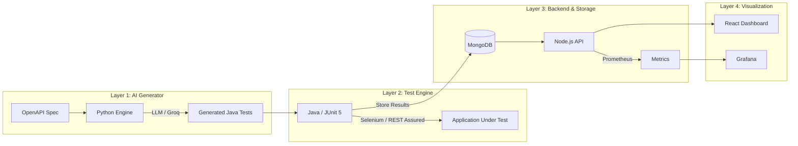

# IntelliQA: AI-Powered Quality Intelligence Platform

[](https://github.com/VishakhaGupta1/intelli-qa/actions/workflows/qa-pipeline.yml)
[](https://github.com/VishakhaGupta1/intelli-qa/actions)

IntelliQA is a comprehensive QA automation ecosystem that transforms OpenAPI specifications into executable test suites using AI. It provides a real-time dashboard for quality metrics, coverage analysis, and defect tracking.

---

## 🚀 Quick Start Guide

### 1. Prerequisites
Ensure you have the following installed:
- **Docker & Docker Compose**
- **Java 17+** (for test execution)
- **Python 3.11+** (for test generation)
- **Node.js 20+** (for dashboard)

### 2. Setup Environment
Clone the repository and create your local `.env` file:
```bash
git clone https://github.com/VishakhaGupta1/intelli-qa.git
cd intelli-qa
# Create .env from template
cp .env.example .env # If .env.example exists, or create one manually
```

### 3. Spin Up Infrastructure
Start MongoDB, Selenium, and the Dashboard API:
```bash
docker-compose up -d --build
```

### 4. Generate AI Tests
Run the Python generator to create Java test cases from the API spec:
```bash
python ai-generator/main.py --spec ai-generator/specs/sample-api.yaml
```
*Note: By default, this uses mock AI responses. Set `GROK_API_KEY` in `.env` for live generation.*

### 5. Execute Tests
Run the generated Java suite:
```bash
mvn -f test-engine/pom.xml test
```

### 6. View Dashboard
Start the React UI:
```bash
cd dashboard-ui
npm install
npm run dev
```
Open [http://localhost:5173](http://localhost:5173) to see your live quality metrics.

---

## 🏗️ Architecture



---

## 📦 Project Structure

- **`ai-generator/`**: Python tool that parses OpenAPI specs and generates Java tests using LLMs.
- **`test-engine/`**: Java/Maven project that executes API and UI tests, reporting results to MongoDB.
- **`dashboard-api/`**: Node.js backend that serves quality metrics and reports.
- **`dashboard-ui/`**: React/Vite frontend for the quality intelligence dashboard.
- **`sample-api/`**: A mock Node.js API used for demonstration and testing.
- **`monitoring/`**: Prometheus and Grafana configurations for system health.
- **`scripts/`**: Utility scripts for database seeding, backups, and secret rotation.

---

## 🛠️ Advanced Usage

### Self-Healing Tests
The generator can "heal" failing tests by analyzing previous run results in MongoDB and adjusting test data or assertions automatically.

### PII Redaction
The platform includes a built-in PII redactor (`ai-generator/pii_redactor.py`) that ensures sensitive data like SSNs, emails, and tokens never leave your infrastructure during AI prompt generation.

### Monitoring
- **Prometheus**: [http://localhost:9090](http://localhost:9090)
- **Grafana**: [http://localhost:3003](http://localhost:3003) (Default: admin/admin)

---

## ❓ Troubleshooting

- **MongoDB Connection**: Ensure port `27018` is free. If using a local Mongo, update `MONGO_URI` in `.env`.
- **Selenium Errors**: If UI tests fail locally, ensure the `qa_selenium` container is healthy or adjust `SELENIUM_REMOTE_URL`.
- **AI Mocking**: If you want real AI generation, set `USE_MOCK=false` and provide a valid `GROK_API_KEY`.

---
