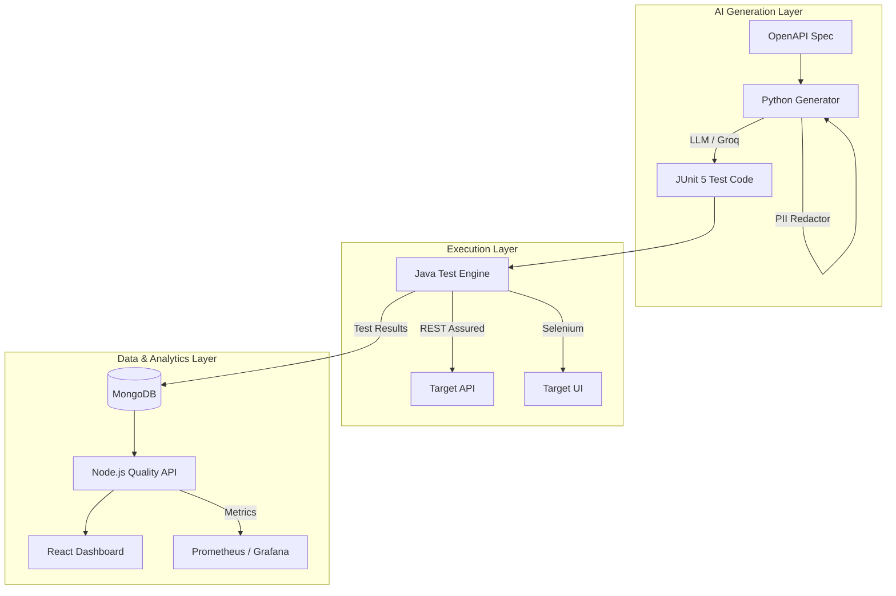

# IntelliQA: Quality Intelligence Platform

IntelliQA is a professional-grade automated testing ecosystem. It leverages AI to transform OpenAPI specifications into executable Java test suites, provides end-to-end UI automation via Selenium, and centralizes all quality metrics into a real-time intelligence dashboard.

## 🏗️ Architecture



## 📋 Prerequisites

Ensure you have the following installed before starting:

- **Docker & Docker Compose**: For database, Selenium Grid, and monitoring.
- **Java 17+ (JDK)**: To execute the Maven-based test engine.
- **Python 3.11+**: For the AI test generation logic.
- **Node.js 20+**: To run the dashboard and metrics API.
- **Maven 3.8+**: For dependency management and test execution.

---

## 🚀 Quick Start

### 1. Configure API Access
Open the existing `.env` file in the root directory and update your Groq credentials:
```env
GROQ_API_KEY=your_key_here
USE_MOCK=false
```

### 2. Launch Platform
Run the startup script to provision infrastructure, generate AI tests, and initialize the dashboard.

**Windows:**
```powershell
.\run.bat
```

**Linux / macOS:**
```bash
chmod +x run.sh && ./run.sh
```

---

## 🛠️ Core Capabilities

- **AI Test Generation**: Uses Llama 3.3 to generate context-aware JUnit 5 tests from OpenAPI 3.0 specs.
- **Self-Healing Engine**: Automatically improves test reliability by analyzing historical execution failures.
- **Privacy-First Design**: Built-in PII redactor scrubs sensitive data before interacting with external AI providers.
- **Unified Analytics**: Real-time visualization of pass rates, flakiness trends, and coverage gaps.
- **Full-Stack Coverage**: Integrated support for REST Assured (API) and Selenium Grid (UI) testing.

## 📊 System Components

| Component | URL | Description |
| :--- | :--- | :--- |
| **Intelligence Dashboard** | [http://localhost:5173](http://localhost:5173) | Primary UI for quality metrics and AI scores. |
| **Quality API** | [http://localhost:3001](http://localhost:3001) | Backend service for result aggregation. |
| **Sample Application** | [http://localhost:4000](http://localhost:4000) | The target system currently under test. |
| **Selenium Grid** | [http://localhost:4444](http://localhost:4444) | Distributed browser automation environment. |

## 📂 Project Structure

- `run.bat` / `run.sh` - Unified startup scripts for the entire platform.
- `ai-generator/` - Python engine for LLM orchestration and spec parsing.
- `test-engine/` - Java/Maven framework for API and UI execution.
- `dashboard-api/` - Node.js service for metrics and MongoDB integration.
- `dashboard-ui/` - React/Vite frontend for quality visualization.
- `monitoring/` - Prometheus and Grafana observability stack.

---
